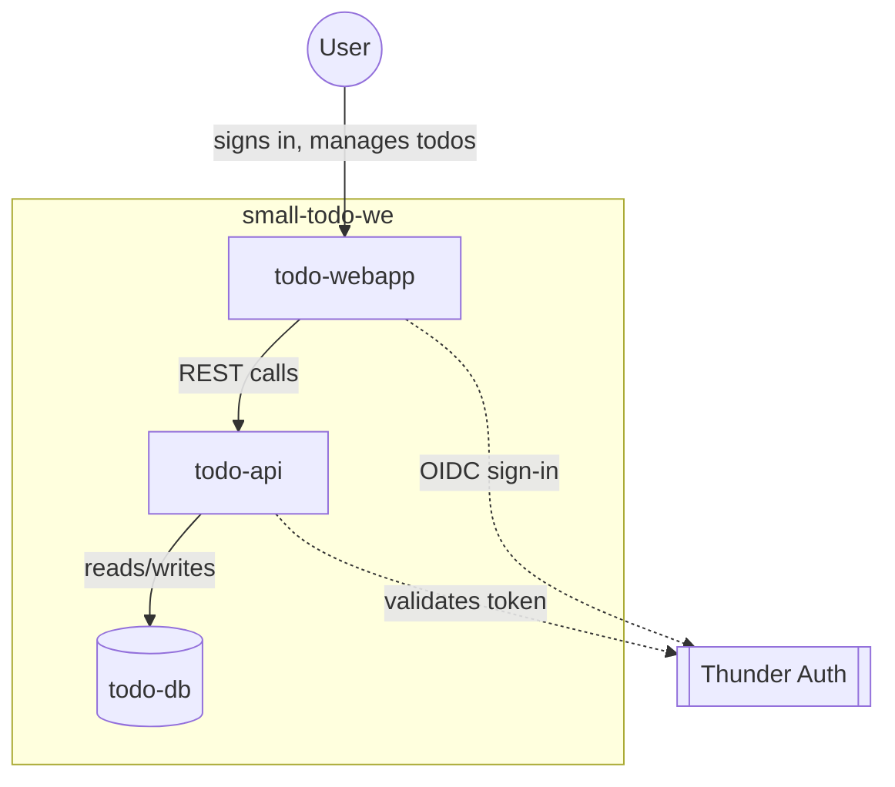
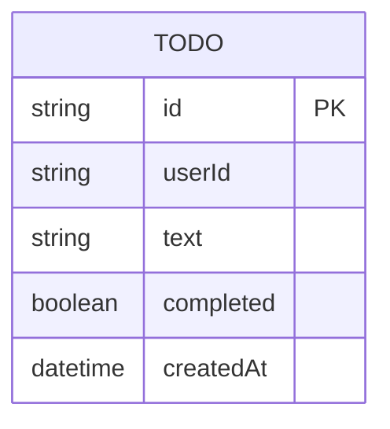
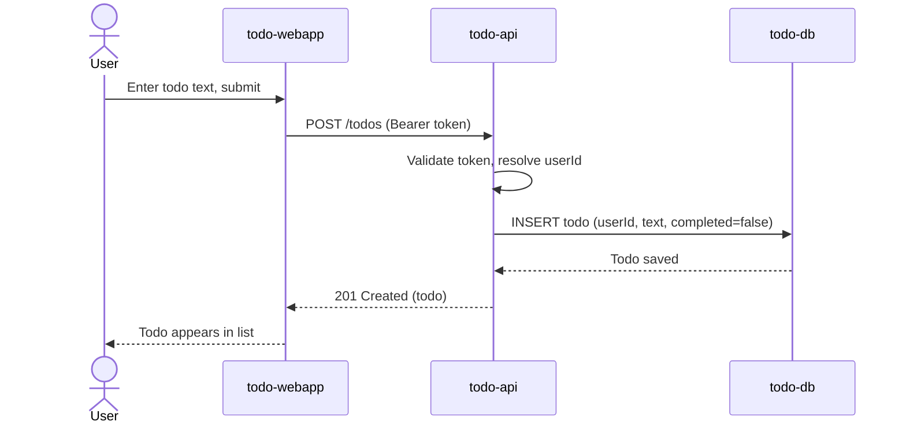
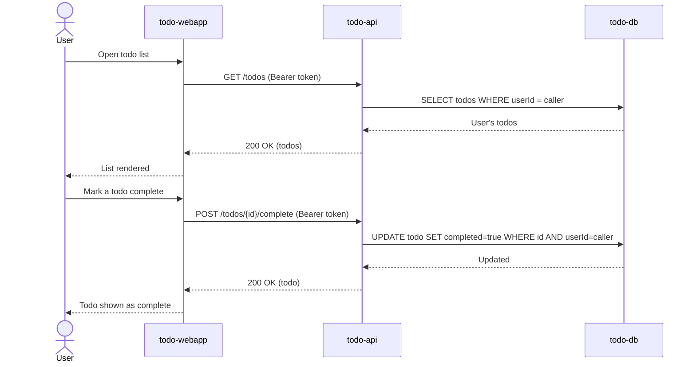

# small-todo-we — Design

## Overview

A small todo app: a single React single-page app (`todo-webapp`) lets a
signed-in User create todos, view their own list, and mark todos complete. It
talks to one Ballerina backend (`todo-api`), which persists todos in a
dedicated Postgres database (`todo-db`) and validates the caller's identity
against Thunder, the platform identity provider, so a user only ever sees
their own todos.

## Context (C1)

## Domain model (ER)

A `Todo` belongs to exactly one User (`userId`, from the Thunder-validated
token) — no other entity is required for this scope.

## Key flows

### Create and save a todo

### View and complete a todo

